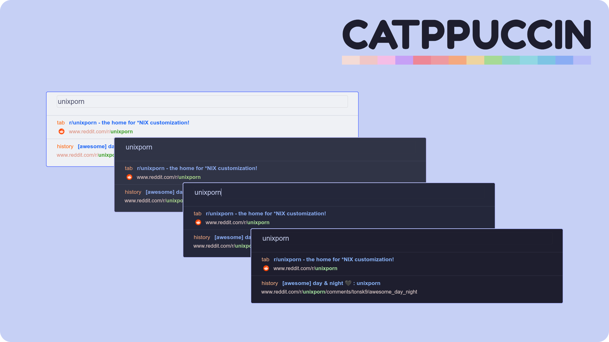

<h3 align="center">
	 
	
	Catppuccin for <a href="https://chrome.google.com/webstore/detail/vimium/dbepggeogbaibhgnhhndojpepiihcmeb">Vimium</a>
	
</h3>

    
    
    

  

## Usage

1. Open Vimum addon's preferences
2. Activate advanced options
3. Copy the content of selected file from `src` folder into the custom CSS field:
    - 🌻 catppuccin-vimium-latte.css
    - 🪴 catppuccin-vimium-frappe.css
    - 🌺 catppuccin-vimium-macchiato.css
    - 🌿 catppuccin-vimium-mocha.css
4. Save changes and reload pages

## 💝 Thanks to

- [elkrien](https://github.com/elkrien)
- [ysjn](https://github.com/ysjn/vimium-simply-dark)

&nbsp;

Copyright &copy; 2021-present <a href="https://github.com/catppuccin" target="_blank">Catppuccin Org</a>

